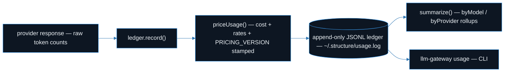

<div align="center">

# 🧮 llm-gateway

**Multi-provider (Anthropic + OpenAI + Ollama), cache-aware LLM cost attribution — with versioned pricing and per-record rate provenance — over an append-only usage ledger.**

[](https://github.com/builtbyai/llm-gateway/actions/workflows/ci.yml)
[](./LICENSE)
[](#install)
[](#api)
[](#install)

**[Providers](#providers)** · **[Install](#install)** · **[Cost Model](#cost)** · **[Ledger](#ledger)** · **[CLI](#cli)** · **[Fleet](#fleet)** · **[API](#api)**

</div>

---

Most token trackers add up `input + output` tokens, multiply by a flat rate, and call it a day. That answer is wrong the moment **prompt caching** is involved — often by **5–10×** on a cache-heavy workload — because it conflates prices that are nowhere near each other. It's wrong a second way the moment you use **more than one provider**, because each vendor prices cache reads differently. And it's wrong a *third* way six months later, when the rate table has moved and you can no longer tell what a historical line actually cost.

`llm-gateway` fixes all three:

1. **Cache-aware.** `cacheCreationInputTokens` and `cacheReadInputTokens` are kept as **distinct fields with distinct multipliers**, all the way from the per-call cost function through the per-model / per-provider rollups.
2. **Multi-provider.** Anthropic, OpenAI, and Ollama each carry their own pinned rates and cache economics. One `computeCost` / one ledger, any provider.
3. **Auditable.** Every rate is stamped with a dated `PRICING_VERSION`, and each ledger record can carry the **exact rates used at compute time** so a cost is reconstructable long after the price table is refreshed.

<a name="providers"></a>

## 🏷️ Provider Cost Models

Each provider prices caching on its own terms — the gateway models each one honestly rather than pretending they're the same:

| Provider | Cache read | Cache write | Example rate (USD/MTok) |
| :--- | :--- | :--- | :--- |
| **Anthropic** | **0.1×** input | **1.25×** (5m) / **2×** (1h) | `claude-opus-4-8` — $5 in / $25 out |
| **OpenAI** | **0.5×** (4o/o-series), **0.25×** (4.1) | none (**1×**) | `gpt-4o` — $2.50 in / $10 out |
| **Ollama** | n/a (local) | n/a | **$0** — every rate is zero |

Anthropic charges a premium to *write* a cache block and a deep discount to *read* it — a **12.5×** spread at the 5-minute tier. OpenAI's caching is automatic: cached input is simply discounted (0.5× for the 4o/o-series, 0.25× for the 4.1 family), with **no** write premium. Ollama runs locally, so its cost is exactly `$0` — which is the point of routing routine work there, and now that shows up truthfully in the rollup.

<a name="install"></a>

## 📦 Install

```bash
npm install llm-gateway
```

Node 18+ (uses the built-in global `fetch`). Zero runtime dependencies.

<a name="cost"></a>

## 💰 The Cost Model

### Per-call cost — any provider

`computeCost(usage, model, ttlOrOptions?)` prices a single response. `model` accepts a canonical id (`'claude-opus-4-8'`, `'gpt-4o'`) or a tier alias (`'advanced'`, `'sonnet'`, `'fast'`, …). The third argument is a cache TTL (`'5m'` | `'1h'`) **or** an options object `{ provider?, ttl? }` — pass `provider` to disambiguate a tier alias shared across vendors.

```ts
import { computeCost } from 'llm-gateway';

// Anthropic cache-hit call: 1M tokens served from cache, 100 generated.
computeCost(
  { inputTokens: 0, outputTokens: 100, cacheReadInputTokens: 1_000_000 },
  'claude-opus-4-8'
);
// => 0.5025   (1M × $5/MTok × 0.1 read-mult  +  100 × $25/MTok)

// OpenAI: cached input billed at 0.5× the base input rate.
computeCost(
  { inputTokens: 0, outputTokens: 0, cacheReadInputTokens: 1_000_000 },
  'gpt-4o',
  { provider: 'openai' }
);
// => 1.25    (1M × $2.50/MTok × 0.5 cached-input mult)

// Ollama: local inference, always free.
computeCost(
  { inputTokens: 5_000_000, outputTokens: 5_000_000 },
  'qwen2.5-coder:14b',
  { provider: 'ollama' }
);
// => 0
```

Under the hood the money is split four ways and summed:

```
baseInput   = inputTokens              / 1e6 * inputCostPerMTok
cacheWrite  = cacheCreationInputTokens / 1e6 * inputCostPerMTok * writeMultiplier
cacheRead   = cacheReadInputTokens     / 1e6 * inputCostPerMTok * readMultiplier
output      = outputTokens             / 1e6 * outputCostPerMTok
```

For Anthropic, `writeMultiplier` is `1.25` (5m) / `2` (1h) and `readMultiplier` is `0.1`. For OpenAI, there is no write premium (`1`) and reads are `0.5`/`0.25`. For Ollama every multiplier — and every base rate — is `0`.

### Versioned pricing registry

Prices are pinned per model (USD/MTok) in `ANTHROPIC_MODELS`, `OPENAI_MODELS`, and `OLLAMA_MODELS`, so a rate change is a one-line edit, not a hunt through the codebase. The whole table is stamped with a dated **`PRICING_VERSION`** — bump it in the same commit as any rate change.

```ts
import {
  PRICING_VERSION,
  getModelDescriptor,
  findModelDescriptor,
} from 'llm-gateway';

PRICING_VERSION;                                    // '2026-07-16'
getModelDescriptor('openai', 'gpt-4o')?.inputCostPerMTok;  // 2.5
getModelDescriptor('anthropic', 'advanced')?.id;    // 'claude-opus-4-8'
getModelDescriptor('ollama', 'any-local-model:7b')?.inputCostPerMTok; // 0

// Provider-agnostic lookup (defaults tier aliases to Anthropic; matches
// OpenAI/Ollama by id). Pass a provider to disambiguate.
findModelDescriptor('gpt-4o')?.provider;            // 'openai'
```

Three providers ship out of the box, each with `fast` / `standard` / `advanced` tier aliases: `anthropic` (Claude), `openai` (GPT / o-series), and `ollama` (local, $0). `getModelDescriptor('ollama', …)` synthesizes a zero-cost descriptor for **any** local model id, so you can meter models you haven't pre-registered.

### Rate provenance — reconstructable costs

`computeCost` returns just the number. `priceUsage` returns the number **plus the exact rates it applied**, so a historical cost can be re-derived and verified independently of the current price table:

```ts
import { priceUsage } from 'llm-gateway';

priceUsage(
  { inputTokens: 1_000_000, outputTokens: 500_000, cacheReadInputTokens: 200_000 },
  'gpt-4o',
  { provider: 'openai' }
);
// {
//   costUsd: 2.75,
//   pricingVersion: '2026-07-16',
//   inputCostPerMTok: 2.5,
//   outputCostPerMTok: 10,
//   cacheReadMultiplier: 0.5,
//   cacheWriteMultiplier: 1,
// }
```

`buildUsageRecord()` (and `UsageLedger.record()`) fold this provenance directly into the ledger line — see below.

<a name="ledger"></a>

## 📒 The Usage Ledger

Every priced call is one line of JSON, appended to a log you never rewrite:



This is the schema of a `UsageRecord`:

```ts
interface UsageRecord {
  timestamp: string;                    // ISO-8601
  provider: string;                     // 'anthropic' | 'openai' | 'ollama' | ...
  model: string;                        // canonical model id
  inputTokens: number;                  // fresh (uncached) input
  outputTokens: number;
  cacheReadInputTokens?: number;        // billed at read-mult   — kept separate
  cacheCreationInputTokens?: number;    // billed at write-mult  — kept separate
  costUsd: number;                      // from computeCost() / priceUsage()
  source?: string;                      // optional call-site tag
  durationMs?: number;                  // optional latency

  // --- rate provenance (stamped at compute time) ---
  pricingVersion?: string;              // PRICING_VERSION in effect
  inputCostPerMTok?: number;            // base input rate applied
  outputCostPerMTok?: number;           // output rate applied
  cacheReadMultiplier?: number;         // cache-read mult applied
  cacheWriteMultiplier?: number;        // cache-write mult applied (for the TTL)
}
```

> [!TIP]
> The cheapest way to write a *correct, auditable* line is `ledger.record()` — it prices the call from raw token counts and stamps cost **and** provenance for you.

```ts
import { UsageLedger } from 'llm-gateway';

const ledger = new UsageLedger(); // defaults to ~/.structure/usage.log

// Anthropic call — cost + rates stamped automatically.
await ledger.record({
  provider: 'anthropic',
  model: 'claude-opus-4-8',
  inputTokens: 1_000,
  outputTokens: 500,
  cacheReadInputTokens: 90_000,
  cacheCreationInputTokens: 2_000,
  durationMs: 1_800,
});

// OpenAI call — record `prompt_tokens - cached_tokens` as inputTokens and
// `cached_tokens` as cacheReadInputTokens; the 0.5×/0.25× discount is applied.
await ledger.record({
  provider: 'openai',
  model: 'gpt-4o',
  inputTokens: 4_000,
  outputTokens: 1_200,
  cacheReadInputTokens: 6_000,
});

// Local Ollama call — recorded at $0, so "free" work is visible, not invisible.
await ledger.record({
  provider: 'ollama',
  model: 'qwen2.5-coder:14b',
  inputTokens: 8_000,
  outputTokens: 3_000,
});
```

Because every line carries its own rates, the cost is verifiable with nothing but the record itself:

```
costUsd ==  inputTokens              /1e6 * inputCostPerMTok
          + outputTokens             /1e6 * outputCostPerMTok
          + cacheReadInputTokens     /1e6 * inputCostPerMTok * cacheReadMultiplier
          + cacheCreationInputTokens /1e6 * inputCostPerMTok * cacheWriteMultiplier
```

Append-only means it is crash-safe, trivially `tail -f`-able, and mergeable across machines — no schema migrations, no lock contention. (Older lines without provenance fields still parse; the fields are optional.)

### Aggregation rollups

`summarize()` (or `ledger.summarize()`) folds the ledger into totals plus `byModel` and `byProvider` buckets. Each bucket carries its **cache read and cache write token totals separately**, so you can see *why* a model is cheap or expensive, not just that it is — and `byProvider` now spans all three vendors.

```ts
const sum = await ledger.summarize();

sum.totalCostUsd;               // grand total USD across providers
sum.cacheHitRate;               // cacheReads / (input + reads + writes), in [0,1]
sum.byProvider['openai'];       // { calls, costUsd, inputTokens, outputTokens, cacheReads, cacheWrites }
sum.byProvider['ollama'];       // costUsd: 0
sum.byModel['claude-opus-4-8'];
```

<a name="cli"></a>

## 🖥️ CLI

A tiny, dependency-free entry point over the same library:

```bash
llm-gateway usage                 # human-readable rollup
llm-gateway usage --json          # machine-readable summary
llm-gateway usage --last 200      # only the most recent 200 calls
llm-gateway usage --records       # raw per-call lines
```

```
Usage summary  (ledger: ~/.structure/usage.log)

  Calls            : 3
  Total cost       : $7.5610
  Cache reads      : 96,000
  Cache writes     : 2,000
  Cache hit rate   : 96.3%

  By provider:
    anthropic          1 calls   $5.0610   cache_read=90,000
    openai             1 calls   $2.5000   cache_read=6,000
    ollama             1 calls   $0.0000   cache_read=0
```

## 📊 Numbers

> [!NOTE]
> Real fleet numbers are not committed — they live on the owner's machines. The table below is a placeholder; **populate it from your own `~/.structure/usage.log` via `llm-gateway usage`** (or `--json` piped into your own reducer).

| Workload | Calls | Median ms | p99 ms | Cache-read % | $/1k calls |
| :--- | ---: | ---: | ---: | ---: | ---: |
| _code-review_ | — | — | — | — | — |
| _doc-summarize_ | — | — | — | — | — |
| _agent-loop_ | — | — | — | — | — |
| _embedding (local)_ | — | — | — | — | — |

<a name="fleet"></a>

## 🛰️ Fleet Routing (optional)

`OllamaFleet` routes inference across a set of local Ollama nodes by task type (reasoning / coding / vision / embedding / fast / general), model availability, and per-node GPU/RAM capability, with a 30-second health cache. The default node list is a **demo topology** (`node-a` / `node-b` / `node-c` on `localhost` and `*.local`) — swap in your own `FleetNode[]` via the constructor.

```ts
import { OllamaFleet } from 'llm-gateway';

const fleet = new OllamaFleet(); // or new OllamaFleet(myNodes)
const route = await fleet.route('reasoning');
// { node, model, reason: 'gpu-node (GPU) -> qwq:32b for reasoning' }

console.log(await fleet.status()); // live health + routing table
```

<a name="api"></a>

## 🔌 API

<details open>
<summary><b>Full export surface</b></summary>
<br>

```ts
import {
  computeCost,        // (usage, model, ttl | { provider?, ttl? }) -> USD
  priceUsage,         // same, but returns { costUsd, pricingVersion, ...rates }
  estimateCost,       // (descriptor, usage, ttl?) -> USD (lower-level)
  cacheHitRate,       // (usage) -> [0,1]
  buildCachedSystem,  // marks stable system/skill blocks as ephemeral

  PRICING_VERSION,    // dated stamp for the whole rate table
  PROVIDERS,          // provider registry (anthropic/openai/ollama)
  ANTHROPIC_MODELS,   // pinned per-model pricing
  OPENAI_MODELS,      // pinned per-model pricing (cached-input aware)
  OLLAMA_MODELS,      // local models ($0)
  getModelDescriptor, // (provider, idOrTier) -> ModelDescriptor
  findModelDescriptor,// (idOrTier, provider?) -> ModelDescriptor (cross-provider)
  resolveModel,       // tier alias -> model id

  UsageLedger,        // append-only ledger class (.record() stamps rates)
  buildUsageRecord,   // raw tokens -> fully rate-stamped UsageRecord
  appendUsage,        // functional append (default ledger path)
  readUsage,          // functional read
  summarize,          // records -> UsageSummary (byModel/byProvider + cache totals)
  ledgerPath,         // default ledger location

  OllamaFleet,        // multi-node router (optional)
} from 'llm-gateway';
```

</details>

## 🛠️ Development

```bash
npm ci
npm run typecheck   # tsc --noEmit
npm test            # jest
npm run build       # emit dist/
```

## 📄 License

MIT — see [LICENSE](./LICENSE).
